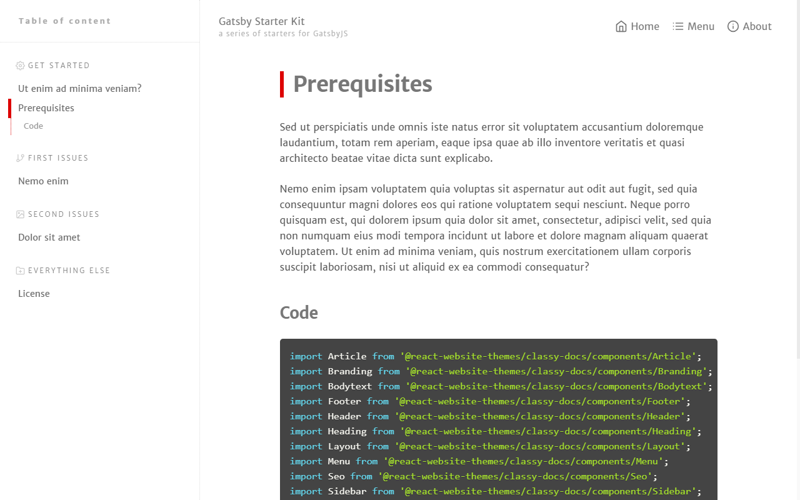

Check this **bold** and _italic_ and ```code``` and <mark>highlight</mark> and [link1](https://google.com) 

## Sub Heading1

- Point 1
- Point 2
- Sub Point 1
- Sub Point 2
- Point 3 


## Sub Heading2

Quis autem vel eum iure reprehenderit qui in ea voluptate velit esse quam nihil molestiae consequatur, vel illum qui dolorem eum fugiat quo voluptas nulla pariatur?

## Sub Heading3 (Code)


```javascript{2,6-8}
// In your gatsby-config.js
plugins: [
  {
    resolve: `gatsby-transformer-remark`,
    options: {
      plugins: [
        `gatsby-remark-prismjs`,
      ]
    }
  }
]
```


```javascript
import Menu from '@react-website-themes/classy-docs/components/Menu';
import Seo from '@react-website-themes/classy-docs/components/Seo';
import Sidebar from '@react-website-themes/classy-docs/components/Sidebar';
import layoutSidebar from '@react-website-themes/classy-docs/styles/layoutSidebar';
```


## Sub Heading4 (Folder structure)

```
root
  └── src
      ├── content
      │   ├── meta
      │   │   ├── config.js
      │   │   └── menu.js
      │   └── parts
      │       ├── copyright.md
      │       ├── footerLinks.md
      │       ├── notFound.md
      │       └── welcome.md
      ├── pages
      │   ├── 404.js
      │   └── index.js
      └── starter
          ├── Article.js
          ├── Bodytext.js
          ├── Branding.js
          ├── Footer.js
          ├── Header.js
          ├── Heading.js
          ├── Layout.js
          ├── MainMenu.js
          └── MainMenuItem.js
```


Have you noticed already? The Gatsby Starter Kit documentation, the website you are looking at now, is built with it. :star:


